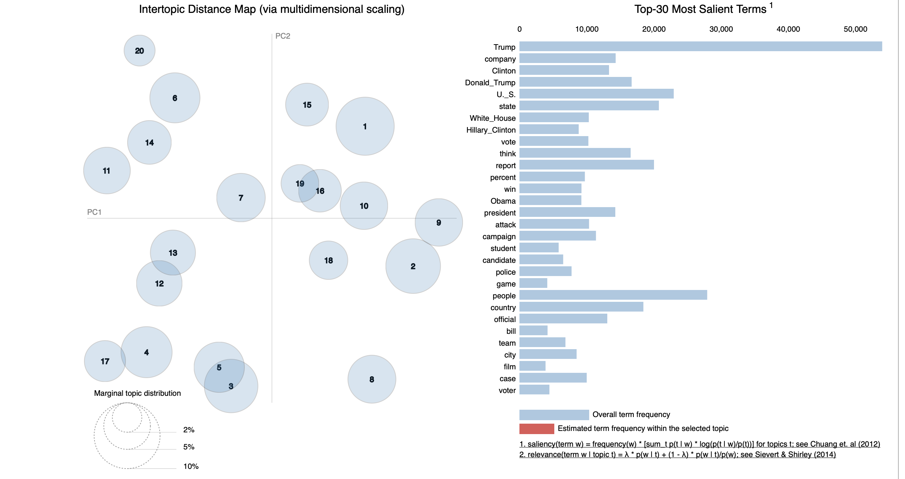

Stan Schepers — August 2021 — Information Retrieval — Code: https://github.com/stanschepers/information_retrieval/

# Report 2: Topic Modeling

## Introduction

In this report I will discuss with topic modeling of news articles. I will conduct several different experiments in the different stages of the process: text preprocessing, choosing the right model, deciding the hyperparameters, etc.

[TOC]

## Experiments

### Data, Preprocessing and Model

For these experiments I will be using the given dataset containing 141,585 news articles. The dataset contains for each article an ID, the title, the news outlet, the author, publication date and the content of the article itself.

Preprocessing is in my/everyone's opinion 80% of the actual work. Choosing and training the model is actually secondary task. So I will be focussing a lot on the preprocessing steps in these experiments.

The default preprocessing steps that were taken are **tokenisation**, **stopword removal**, **case-folding**. Also accents, non-ASCII characters, escape characters, e-mails and URLs were removed. When not specified also **lemmazation** is used. The minimum length of a word has to be two. Unless specified only the first 50 sentences are used to reduce the running time significant. In the experiment 'Number of Sentences' we will learn that this also will increase the performance of the models.

For the topic modeling I will be using the Latent Direchlet Allocation (LDA) Model from the library `gensim`[^gensim]. In the experiments around the preprocessing phase we will be using the default hyperparameters and the number of topics $k$  is10 unless specified different.

Most preprocessing steps are implemented in the file `nlp_preprocess.py`. The structure of the file, class and methods are based on this project: https://github.com/nikhiljsk/preprocess_nlp. 

[^gensim]: https://radimrehurek.com/gensim/auto_examples/index.html#documentation

### Workflow and Evaluation

All comparing experiments are performed 5 times each using a different portion of the data set (≈ 30,000 articles). Results that are given are the average of the results of the seperate results. There is an experiment structure implemented to implement experiments in a consistent and fast matter. This allows me to run the 5 seperate experiments in a single experiment in parrallel. The execution of the experiments take a long time so it is nice that useful prints are implemented like the configuration, the results in human readable tables and that the results are stored in a file. This way I can leave the experiments running over night on my machine. Finally some methods are implemented to store corpora, models, dictionaries and texts.

Performance is measured using the **coherence score**. Topic Coherence measures score a single topic by measuring the degree of semantic similarity between high scoring words in the topic. These measurements help distinguish between topics that are semantically interpretable topics and topics that are artifacts of statistical inference. [^coherence]  `c_v` coherence is used so the performance will range between 0 and 1.

Note when comparing scores between model with different $k$ values that higher $k$, number of topics, have the tendency to have slighty higher scores.

During the initial state of this project the models were also evaluated using top words per topic.

[^coherence]:(https://towardsdatascience.com/evaluate-topic-model-in-python-latent-dirichlet-allocation-lda-7d57484bb5d0)

**Performance Base Model**

The performance of the base model i.e. using the previuosly described preprocessing and k=10 is **0.488888**. The 5 top words are given for each topic:

```python
[(0,
  '0.042*"trump" + 0.013*"clinton" + 0.010*"trumps" + 0.010*"president" + 0.009*"campaign"'),
 (1,
  '0.010*"news" + 0.007*"trump" + 0.007*"president" + 0.006*"house" + 0.006*"investigation"'),
 (2,
  '0.012*"people" + 0.010*"like" + 0.008*"one" + 0.007*"dont" + 0.006*"think"'),
 (3,
  '0.011*"would" + 0.009*"court" + 0.008*"law" + 0.007*"states" + 0.007*"federal"'),
 (4,
  '0.012*"game" + 0.009*"team" + 0.007*"first" + 0.006*"season" + 0.006*"players"'),
 (5,
  '0.011*"us" + 0.007*"united" + 0.006*"president" + 0.006*"government" + 0.006*"military"'),
 (6,
  '0.007*"new" + 0.006*"one" + 0.005*"first" + 0.004*"show" + 0.004*"like"'),
 (7,
  '0.014*"police" + 0.006*"people" + 0.006*"told" + 0.006*"city" + 0.005*"two"'),
 (8,
  '0.010*"percent" + 0.009*"company" + 0.007*"new" + 0.007*"million" + 0.006*"companies"'),
 (9,
  '0.008*"says" + 0.006*"people" + 0.005*"water" + 0.005*"food" + 0.005*"new"')]
```

### Preprocessing Experiments

**Stemming vs. Lemmazation**

Stemming tries to reduce a word to its root word by removing the possible suffix. In this experiment the `SnowBallStemmer` from `nltk`[^nltk] or Porter2 Stemmer is used. This is an improvement on the Porter Stemmer that is a fast stemmer however not the most precise.

As stemming is actually not more than cutting of the tail, lemmazation uses a model to determine the lemma of a word. It has more context. E.g the word `better`will likely be become `be`using a stemmer. However the model used in lemmazation knows that `better`is derived from `good`.

We use stemming or lemmazation to reduce the number of possible words by mapping words that are derived from each hother to the same word. This way we want to find plurals, adjectives, ... from words.

[^nltk]:(https://nltk.org)

| n_topics | preprocessing | coherence_mean |
| -------: | :------------ | -------------: |
|       10 | lemmatization |       0.526882 |
|       10 | stemming      |         0.5257 |
|       50 | lemmatization |       0.528316 |
|       50 | stemming      |       0.513829 |

In our dataset and model setting I see little difference in the stemming and lemmatisation.

**Number of Sentences**

Articles start mostly with a kind of abstract. My hypothese is that the first 10 sentences contain most words to determine the topic of the article. By using a certain amount of sentences of the articles I hope this will cut preprocessing times. I also expected that the data using the first few sentences gives a more dense respresentation of the article and hopefully words that are related to the topic that occur in the body of article will be omitted this way.

| n_topics | n_sentences | coherence_mean |
| -------: | ----------: | -------------: |
|       10 |         all |       0.447265 |
|       10 |          10 |       0.488888 |
|       10 |          50 |       0.473598 |
|       10 |         100 |       0.453009 |

**N-grams**

A N-gram is a sequence of $n$ words that can be found in the sequential data. if a sequence of $n$ words occur a lot in the data set we will make a single token of it. This way we can take common groups of words as one token as the words seperate have little meaning or even have a different meaning. It is also a good way to distinguish peoples name as last names are often shared and the combination of first name and last name often occur in these 

| n_topics | ngrams | coherence_mean |
| -------: | -----: | -------------: |
|       10 |      1 |       0.488888 |
|       10 |      2 |       0.515505 |
|       10 |      3 |       0.517331 |
|       50 |      1 |       0.542408 |
|       50 |      2 |       0.536831 |
|       50 |      3 |       0.519965 |

Not what I expected, however the 1-grams (so not using n-grams) performs better in our dataset.

**Extra parameter: Filtering Extremes**

`gensim` allows us to filter tokens based on the occurence in the dataset. We can set a minimum of documents that have to contain a certain token and we can set maximum fraction of docuements that can contain token before it is omitted. Setting a maximum fraction is interesting as if a token occurs in more than 1/3, 1/2, 3/4, 4/5 of the docuements the token will have probably no meaning for the topic as they are so common. Words that occur less than 5, 10, 20, 50 docuemnts have little meaning for the topic as most topic groups are many times larger. 

Many lentghy experiments showed rather little differenced. So I decised to go with minimum 20 documents and maximum 50% of the documents. Expecting even distrubtion among the topics: every topic would have 15,000 articles. Even when this size is 10 times smaller: 1500 articles. Twenty documents would still respresent only 1% of these topic. Even in a dataset with a lot of political 

### Model Experiments

**Number of passes**

We can control  the number of passes through the corpus during training. Let's see if it has any affect. 

| n_topics | n_passes | coherence_mean         |
| -------- | -------- | ---------------------- |
| 10       | 1        | 0.4761106550929009     |
| 10       | 5        | 0.532231681221827      |
| 10       | 10       | 0.5372365308781465     |
| 10       | 20       | 0.5427554679174906     |
| 10       | 50       | **0.5450676791962735** |
| 10       | 100      | 0.519392137259488      |
| 10       | 200      | 0.5200250298669041     |

More passes will lead to better performance as the data is seen more often during training. However it seems to peak at 50 in our case.

**How to choose an optimal $k$​​​ value?**

A way to determine the a good $k$ value is to see a plot the coherence score for several number of topics $k$.[^optimal] Mostly the conherence score will keep on getting bigger. However for a certain $k$ it will stop getting bigger so quickly. This $k$ is the optimal $k$-value. This method is called the elbow-method. 💪

This plot is given below using our dataset and model for different values of $k$. Also a table is added for some $k$-values. We can see that a good $k$-value would be 20. No surprise here because the assignment requires to use this in the final model.

[^optimal]:(https://www.machinelearningplus.com/nlp/topic-modeling-gensim-python/#17howtofindtheoptimalnumberoftopicsforlda)


| n_topics | coherence           |
| -------- | ------------------- |
| 5        | 0.40721806951962414 |
| 10       | 0.4754010261947735  |
| 20       | 0.5268955494312738  |
| 30       | 0.5213219768787278  |
| 40       | 0.5388654969920681  |
| 50       | 0.5201395604111796  |
| 100      | 0.539072956788642   |

**Which Model To Use?**

Earlier versions of`gensim ` provided twee implementations of the LDA: normal LDA and Mallet LDA. The normal (gensim) LDA uses an *online variational Bayes algorithm* by Hoffman et al. Mallet LDA uses optimized *Gibbs sampling algorithm* by Yao et al. Note that MALLET is Java-based statistical NLP packacke that requires to be installed separately [^mallet].  Current versions of `gensim`don't have to wrapper class to use MALLET so this is added the code from earlier version.

This source [^optimal] claims that using Mallet LDA will increase the coherence scores by a few points. The results between the comparison are shown below. Note that for this experiments `SpaCy`preprocessing was used. For 'translating' MalletLDA to GenSimLDA I used code from [^mallettransform]. 

| Model      | Coherence Mean |
| ---------- | -------------- |
| GenSim LDA | 0.485164       |
| MALLET LDA | 0.513146       |

Mallet LDA performance in our case a little bit better.

[^mallettransform]: https://neptune.ai/blog/pyldavis-topic-modelling-exploration-tool-that-every-nlp-data-scientist-should-know

### SpaCy Preprocessing

`SpaCy`[^spacy] is a newer kid on the block than `nltk`. It is also NLP library however it uses trained pipelines using state-of-the-art nlp models to do its tasks. `SpaCy`is capable of many cool things like assigning Part-of-Speech , assigning dependency labels, word2vec (token2vec), ... `SpaCy`is also highly customisable to your needs and data set. To run this code you need to download the the different models locally. Below are some cool visualisations of the capability of `SpaCy`from their documentations[^spacy_vis].


 In our pipeline we will be tokenising, removing stopwords, lemmatizing and keeping only certain Part-of-Speech tags: nouns (e.g. apple), verbs (e.g. fly), adjectives (e.g. aggressive) and even proper nouns (e.g Trump, Clinton). 

The reason to not start with `SpaCy` is that is discouraged by the documentation.

```
# https://spacy.io/usage/facts-figures
spaCy is built on the latest research, but it’s not a research library. If your goal is to write papers and run benchmarks, spaCy is probably not a good choice. However, you can use it to make the results of your research easily available for others to use, e.g. via a custom spaCy component.
```

[^spacy]:https://spacy.io
[^spacy_vis]:https://spacy.io/usage/visualizers

#### Final note on the results

Finally after all these experiments I notice that many differences in the results are actually somewhat small for having real significance. Note that this experiments are for this dataset and every dataset will have it own ideal 

## Final Model and Extra Insights

### Choosen Preprocessing

For preprocessing SpaCy was choosen as this was way faster at doing the same job. In addition to the tokenisation, case-folding, lemmatization, keeping only wanted part-of-speech elements (adverbs, adjectives, nouns, verbs and proper nouns), I also added 

### Choosen Model and Hyperparameters

Given 20 is the optimal $k$ Value, I will be using that. As we have seen that Mallet LDA performances slightly better I will be using this.

### Results Top 100 with $k=20$​

For each topic, top 100 document that best represents it are given in `topic_document_rank.csv`.  Each column in the CSV file represents a topic. The first lrow of the file contains the respective topic ids for each column. The remaining lines will contain the results in decreasing order for each topic.

Below a list of the topic ids with its respective topics are given. For each topic also a couple of relevant terms were given that contributed to my decision of naming the topic. The difference between larger and smaller $\lambda$ is given in the paragraph about visualisation.

The coherence score of this model is 0.5131154325129239.

| Topic Id | Topic                             | Relevant Terms (larger $\lambda$)                            | Relevant Terms (smaller $\lambda$)                           |
| -------: | --------------------------------- | ------------------------------------------------------------ | ------------------------------------------------------------ |
|        1 | Law Inforcement, Police           | police, arrest, man, officier                                | police_officier, cop, shooting                               |
|        2 | Culture                           | Artist, world, write, story, music                           | Beyoncé, book, album                                         |
|        3 | Presidential Campagne 2016        | Trump, Clinton, campaign, tweet, Trump_campaign, candidate   | Tim_Kaine (candidate vice-president), elector, Crooked_Hillary |
|        4 | International (Geo)Politics       | Trump, Washington, foreign_policy, Putin, World, China, country | NATO, NAFTA, trade_deal, Xi_Jinping                          |
|        5 | 2016 Party presidential primaries | Trump, Cruz, win, election, party, Bernie_Sanders, Hillary_Clinton, lead, race | Win_nomination, Cruz_campaign, Iowa_caucus, primary          |
|        6 | Middle East                       | Syria, report, attack, military, U.S.                        | ISIS, Mosul, Taliban, Iraq,                                  |
|        7 | Finance                           | Company, business, investor, sell, economy                   | Interest_rate, stock_market, unemployment_rate               |
|        8 | Twitter (comedy)                  | Donald_Trump, Breitbart_news, think                          | Bill_Maher (comedian), @IanHanchett, @pamkeyNEN, Hanchett_Twitter |
|        9 | Movies                            | film, movie, star, director, actor                           | Star_Wars, Harry_Potter, Hollywood                           |
|       10 | Education and Research            | student, help, study, university, child, scientist, school   | New_study, lead_author, Yale (university), classroom         |
|       11 | Russian Hack                      | Investigation, state_department, case, official, information, Russia | FBI, CIA, WikiLeaks, Russian_intelligence, NSA               |
|       12 | U.S. Congress                     | Congress, bill, government, vote, repulicans, democrats, law, plan | Obamacarse, House_Republicans, Congressional_Budget, bill_pass, Freedom_Caucus |
|       13 | Foreign Politics                  | Government, law, vote, state, party, Britain, Europe         | European_Union, EU, Brexit, Boris_Johnson, Pope Francis      |
|       14 | Justice                           | State, law, lawyer, prosecutor                               | trial, court, sentence, file_lawsuit,                        |
|       15 | Science and Geography             | city, water, land, Earth,                                    | NASA, ocean, rain                                            |
|       16 | Companies                         | company, employee, technology, customer                      | Apple, Uber, Google, iPhone                                  |
|       17 | White House                       | Trump_administration, White_house, president_Donal, decision | Executive_order, travel_ban, Spicer (WH press secretary),    |
|       18 | Sports                            | Game, player, athlete, team, season                          | NFL, Olympics                                                |
|       19 | Social Media                      | Facebook, social_medium, website, Twitter, Platform, ad      | Reddit, SnapChat,                                            |
|       20 | Immigration and Gun Control       | immigrant, gun control, border                               | Central America, NRA, drug_traficking                        |

### Visualisation

For visualising these results I have used the library `pyLDAvis`[^vis], "a port of the fabulous R package[^r] by Carson Sievert and Kenny Shirley". This library allows uses to visualise the different topics as clusters and to compare word frequency between the whole dataset and a certain topic. The circles on the left are topic circles [^circle]. These represent each topic with the area set to be proportional to the proportions of the topics across all tokens in the corpus. The position of the circle is determined by using multidimensional scaling on an inter-topic distance matrix that is computed using Jensen-Shannon divergence, a measure that I learned in my bioinformatics class . This will visualise the level of similarity of the topics into the Cartesian space. This means that more similar topics will be closer toghether.

Because the visualisations are interative in a Jupyter notebook, screenshots will be provided below in this report however an interactive version can be found in `lda_visualisation.ipynb`.  In this section we will discuss the visualisation of an LDA model, not the final model, using the `SpaCy` preprocessing + lemmatisation with 20 topics.


At first sight we see that the topics are spread around the 2D space with certain groups closer to each other. Let's discuss the left group consisting of topics 2, 5, 11, 14 using the most relevent terms on the right side. 

<div style="display: flex;">   
	<div style="  flex: 33.33%;padding: 5px;">     
		  
  </div>   
		<div style="  flex: 33.33%;padding: 5px;">         
	   
		</div>
</div>
<div style="display: flex;">   
	<div style="  flex: 33.33%;padding: 5px;">     
		  
  </div>   
		<div style="  flex: 33.33%;padding: 5px;">         
	   
		</div>
</div>

Using this we see an interesting main topic: political news. However this broad topic is split in different topics:

- **Topic 2:** World leader news (President Obama, Putin, President Trump, ...)
- **Topic 5:** News on the campaign for the presidential elections (Trump Campaign, investigation, email, alligation, Fox News,)
- **Topic 11:** News on the U.S. Federal government, U.S. Congress (Afforable Care Act, Health Insurance, Obamacare, vote, bill, pass, congress)
- **Topic 14:** News on political issues (Free Speech, Civil Right, protest, activist, issue, people)

Note that n-grams really helped to distinguish certain topics better like in topic 5, the news on the campaign, the token "President_Trump" does not appear because at the time of the news he was not president. However in topic 2, world leaders and politics, he is and the token "President_Trump" start to appear. Also names appear that would have different meaning if the different words in the name would be seperated like "Fox News". If for example a lot of texts out of biology classes were included about animals like foxes this could have an effect on the model because it can distinguigh between them.

Also the preprocessing from SpaCy worked will in lemmatization (all words presended are root terms) and only verbs, nouns, adjectives, adverbs and proper nouns are present. (execpt for the "_" which is not discarded during preprocessing.)

The following visualisation is the one of the final model.



After naming the different topics we note sevaral interesting things from this graph:

1. Similar topics are closer to each other eg. Topic 3 and 5 (Presidential Campagne, Presidential Primaries), Topic 16 and 19 (Companies and Social Media), ...
2. The articles are more or less evenly distruted amont the topics.
3. ...

Some notes are best shared on the graph it self, so I have drawn the graph using the topics names instead of ids and annotated some thought I had seeing this topics on the graph.


### Relevant terms and $\lambda$

When identifying topics the relevant words given by `pyLDAvis` are a useful tool. When looking at the relevant terms of a certain topic it is possible to change the $\lambda$ value in the relevance score. I noticed that this has an effect on the relevant terms returned in an useful way. When the $\lambda$ is high it returns terms that relevant to topic but occur a lot in the dataset and also occur in different (similar) topics. When setting $\lambda$ to a small value it will return still relevant terms but these terms will almost exclusively be found in this certain topic. 

This comes in handy as to determine the topic names of certain topics that have very general relevant terms, however when lowering the $\lambda$ certaining identifiable  terms come up.This is why I choosen give two kind of relevant terms with the topic names.

Another interesting thing I found with playing with this lambda value is that when lowering this value sometimes terms come up that are indentified wrongly by the model. Because of the low lambda value, these terms will almost exclusivly being identified wrongly. In the future I would like to check if this method is an easy way to identify problems in the model. An example in our data set was "Boko_Haram" that was in the topic of "Immigration and Gun Control" but one would think that this should be in the topic "Middle East". This topics are found close to each other, thus probably some hyperparameter tuning will do the trick here.


[^vis]: https://pyldavis.readthedocs.io/en/latest/readme.html
[^r]: https://github.com/cpsievert/LDAvis
[^circle]: https://cran.r-project.org/web/packages/LDAvis/vignettes/details.pdf


## Wrapping Up

As a final note I want to acknowledge the art of natural language processing. Languages are hard to measure and to understand in algorithms. For example my base model and my final model have similar coherence scores however when looking at the outcome of the model. The final model gives a lot more insight in the dataset. It has to be said, "All models (and visualisation tools) are wrong, some are just more useful than others".

In the future I would like to work on improving the performance, implmenting a frameworking for easy and fast preprocessing —long proccing time makes this hard— and more visualisations.

## References

Hoffman, Matthew, Francis R. Bach, and David M. Blei. *"Online learning for latent dirichlet allocation."* advances in neural information processing systems. 2010.

Yao, Limin, David Mimno, and Andrew McCallum. *"Efficient methods for topic model inference on streaming document collections."* Proceedings of the 15th ACM SIGKDD international conference on Knowledge discovery and data mining. 2009.

https://github.com/nikhiljsk/preprocess_nlp

[^mallet]:http://mallet.cs.umass.edu/index.php

