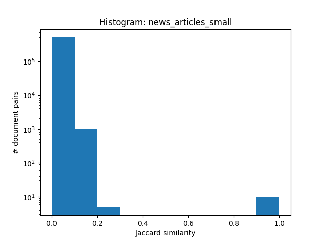
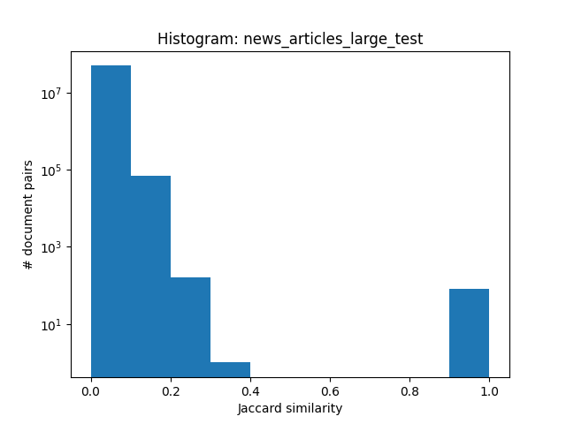
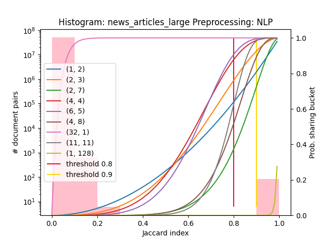
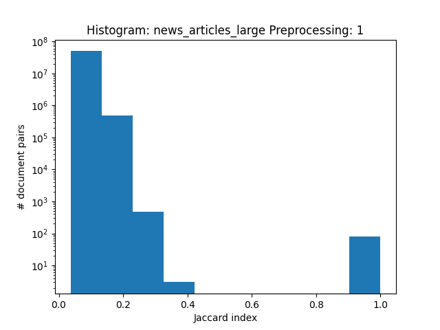
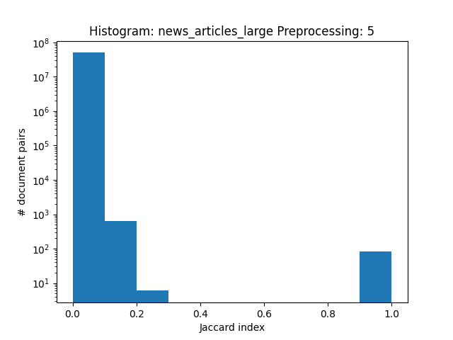

Stan Schepers – August 2021 – Information Retrieval - Code: https://github.com/stanschepers/information_retrieval/

# Report 3: Plagiarism Detection

In this report we will be discussing plagaiarism detection using Locality Sensitive Hashing (LSH). When comparing
documents for (near-)duplicates we can use the Jaccard index (further often called similarity) $= \frac{D_1 \cap D_2
}{D_1 \cup D_2}$ using k-shingles, k-grams of the documents $D_1, D_2$. (When we want to compare a dataset we can do
this, the brute force way: comparing using the Jaccard index all documents with each other. The time complexity of this
comparision $O(n^2)$ (😱) with $n$ is the number of documents. Thus this is not scalable.

We will be using the more scalable method for (near-)duplicates detection: Locality Sensitive Hashing with Minhashing.
This method is seen in class.

## Similarity Analysis

Let's see to the brute force comparison between the documents. A histogram of the number of document pairs and their
similarity for both data sets are shown below. We can see that there is a large distiction between 2 groups: one group
with a Jaccard similarity smaller than 0.4 and one group a Jaccard similarity between 0.9 and 1. The late group are
the (near-)duplicates. The number of matches with threshold 0.8 is 10 for news_articles_small abd 82 for
news_articles_large. The time to calculate (without preproccesing) all similarities is on average 202 seconds.

These matches are taken as grouth truth for the rest of the report.

<div style="display: flex;">
  <div class="flex: 33.33%;padding: 5px;">
    
  </div>
  <div class="flex: 33.33%;padding: 5px;">
    
  </div>
</div>

## Preprocessing

**K-Shingles**

The form of preproccing we have seen in class is k-shingles. This method will split the text in a set of characters of a
specified length $k$ e.g. a 2-shingle of "U.S. invaded Iraq in 2003." $\rarr$ {"U.S. invaded", "invaded Iraq", "Iraq in"
, "in 2003"}.

**Natural Language Preprocessing**

As we are looking also are looking for near-duplicates I want to take small changes in the text in to account like: "
U.S. invaded Iraq" vs "Iraq is being invaded by U.S. ". Because these sentences are duplicates in meaning we expect that
the similarity between them would be close to 1. However k-shingles from the strings would be not grap to that idea. In
this case the Jaccard index would be 0 even if $k>1$ ({"U.S. invaded", "invaded Iraq"} vs. {"Iraq is", "is being", "
being invaded", "invaded by", "by U.S."} ).

Natural Language Preprocessing (NLP) tokenises, removes stopwords, (optional) lemmatises or stem words, remove
punctuations etc. **My hypothese is that plagiarism where some sentences are rewritten but the meaning is the same will
be catch by using NLP in the preprocessing.**

Another note that can be made is that, especially for larger $k$ values, the Jaccard index will be sensitiver when
looking for exact duplicates.

### Comparison

The different proposed preprocssing methods are first compared by the time needed to preprocess the large data
set, `news_articles_large.csv`, the average size of the documents, time comparising and the matches. The results shown
below are the average of 10 experiments.

| Preproccessing Methods | Time Preproccessing (in seconds, wall time) | Average size of docuement (# tokens) | Time brute force comparison (in seconds, wall time) | Number of matches (threshold = 0.8) |
| ---------------------- | ------------------------------------------: | -----------------------------------: | --------------------------------------------------: | ----------------------------------: |
| 1-Shingle (tokenise)   |                                      5.0791 |                             190.6104 |                                                 278 |                                  82 |
| 2-Shingle              |                                      4.5371 |                             256.4224 |                                                   / |                                   / |
| 5-Shingle              |                                        5.22 |                             258.5242 |                                                 282 |                                  82 |
| 7-Shingle              |                                      4.7972 |                             256.5403 |                                                   / |                                   / |
| 10-Shingle             |                                      4.7387 |                              253.543 |                                                 295 |                                  82 |
| NLP                    |                                       4.962 |                             149.0068 |                                                 202 |                                  82 |
| NLP with lemmatisation |                                      8.4662 |                             147.5701 |                                                   / |                                   / |
| NLP with stemming      |                                      9.6424 |                             146.4729 |                                                   / |                                   / |

The conclusion is that NLP (without stemming or lemmatisation) reduces the average size of the document while being as
fast as the k-shingling preproccing. The other NLP methodes do also a good job at reducing the average document size.
However stemming and lemmatisation have a large penalty in clock time. Smaller document size in combination with smller
tokens (tokens from 10-shingle are larger than 1-shingle) leads to faster brute force comparison.

To see if reducing the average size of the document has an effect on the similarities between the documents histograms
are provided below. *Ignore for the moment the extra plots on the histogram.*

<div style="display: flex">
	<div style="flex: 33.33%;padding: 5px;">
		
	</div>
	<div style="flex: 33.33%;padding: 5px;">
		
	</div>
	<div style="flex: 33.33%;padding: 5px;">
		
	</div>
</div>

When inspecting the matching articles we can see why there are a lot of pairs with ≈ 1 Jaccard indices: the matching
articles are exactly the same. The found matches are also all the same. I conclude from this that are (problably) no
near-duplicates, only duplicates. So playing with the threshold will have less affect on the number of matches.

## Local Sensitive Hashing

The brute force methods is painfully slow on the large data set. Even when using multiprocessing on a 6-core CPU. Let's
introduce LSH using MinHash! In these experiments the efffect of the hyperparameters Signature length $M$, number of
rows per band $r$, number of bands $b$ are shown and their effect on the performance of LSH.

**Hyperparameters** and **Similarity Threshold**

The signature length $M$ (number of rows in our signature matrix), the number of bands $b$ and the number rows per band
$r$ are hyperparameters that have an influence on the number of false positive and false negative matches coming from
LSH. Parameters $b$ and $r$ are influenced by $M$ as $M \geq b * r$. A higher $b$ implies a lower similarity threshold,
thus more false positives. Lower $b$ implies higher similarity threshold, more false negatives [^lsh].

Assume that we are looking for articles that are at least 80% similar, i.e. a similarity threshold $s$ of 0.8. We want
to choose $M$, $r$ and $b$ so that the probibility of docuemnts that are more than $s$ similar share a bucket is 1 and
that the probibilty of documents that are less than $s$ similar do not share a bucket. The probability of false
negatives at a threshold $s$ is given by $(1-t^r)^b$. The probability of false positives at a threshold $s$ is given by
$1 - (1-t^r)^b $. Given the wanted threshold $s$ we can adjust $r$ and $b$ and $M$ to get acceptable false positive and
negative rates. This is visualised below by the left figure that was seen in class.


<div style="display: flex">
	<div style="flex: 33.33%;padding: 5px;">
		
	</div>
	<div style="flex: 33.33%;padding: 5px;">
		
	</div>
</div>
In the right figure above I have visualised different $M$, $b$, $r$ using the formule for the probibility of sharing a bucket in function the Jaccard index on top of the histogram of the number of document pairs in function of the Jaccard index.

We expect in the experiments the following things (as seen in class):

1. Higher values for $b$ implies more false positives, lower values for $b$ implies more false negatives.
2. Higher values for $r$ implies less false positives, lower values for $r$ implies less false negatives.
3. When looking at the histogram we expected for example that:
    1. ($b$, $r$) pairs [(1, 2), (2, 3), (4, 4), (6, 5) ] will have some false positives.
    2. ($b$, $r$) pair (32, 1) will have a lot of false positives.
    3. When looking for possible ($b$, $r$) pairs that have more false negatives we best can use $s=0.9$ as there are no
       document pairs with a similarity between $0.8$ and $0.9$. These are probably pairs like [(1, 128), (2, 7)].
4. Larger signature length $M$, requires more calculations, resulting in higher wall times.

Note that if we fine tune, i.e. adding more bins, to the histogram we could have even a better guess at good parameters.

### Experiments

**Setup and libraries used**

For these experiments are using the large data set. I have choosen for the NLP preproccessing from my second report
Topic Modeling. See more in this report on the steps and the libraries used. I used the implementation of MinHashing and
LSH from the library `datasketch` [^datasketch]. A lot of the documentation from the library is used in my scripts. The
ranges for signature length $M$ are [2, 128] (in class $M=100$ was suggested for a similar-sized dataset) in function of
that $M$, $r$ and $b$ were choosen to provoke more false positives, more false negatives and good results. For every
experiment precision, recall and specificity wwere calculated using the grouth truth from the brute force method. Also
the wall clock time for every experiment is given and the approximate threshold given by $s \sim (1/b)^{1/r}$.

**Small tweaks**

I have written software to store the matches using the brute force method to speed up the process of experiments with
hyperparameters and comparing while using the large dataset. Also in parts of the code where multiprocessing can benefit
wall time performance, this is implemented with the standard Python library `multiprocessing`. You can tweak the number
of processes.

**Results**

|    M |    b |    r | sensitivity/recall | specificity |   precision | time (in s) | aprrox. threshold |
| ---: | ---: | ---: | -----------------: | ----------: | ----------: | ----------: | ----------------: |
|    2 |    1 |    2 |                  1 |    0.999998 |  0.00566925 |       2.843 |                 1 |
|    2 |    2 |    1 |                  1 |    0.999998 | 5.00007e-05 |       7.256 |               0.5 |
|    4 |    1 |    4 |                  1 |    0.999998 |     0.88172 |       2.968 |                 1 |
|    4 |    2 |    2 |                  1 |    0.999998 |   0.0014628 |       3.166 |              0.71 |
|    8 |    1 |    7 |           0.987805 |    0.999998 |           1 |       3.121 |                 1 |
|    8 |    1 |    8 |           0.987805 |    0.999998 |           1 |       2.987 |                 1 |
|    8 |    2 |    3 |                  1 |    0.999998 |   0.0677126 |       3.229 |              0.79 |
|    8 |    2 |    4 |                  1 |    0.999998 |    0.331984 |       3.136 |              0.84 |
|   16 |    1 |   16 |           0.987805 |    0.999998 |           1 |       3.386 |                 1 |
|   16 |    2 |    7 |                  1 |    0.999998 |           1 |       3.184 |              0.91 |
|   16 |    2 |    8 |                  1 |    0.999998 |           1 |       3.284 |              0.92 |
|   16 |    3 |    5 |                  1 |    0.999998 |    0.796117 |       3.356 |              0.80 |
|   16 |    4 |    4 |                  1 |    0.999998 |    0.142361 |       3.334 |              0.71 |
|   32 |    1 |   32 |            0.97561 |    0.999998 |           1 |        3.58 |                 1 |
|   32 |    2 |   16 |                  1 |    0.999998 |           1 |       3.403 |              0.96 |
|   32 |    3 |   10 |                  1 |    0.999998 |           1 |       3.569 |              0.90 |
|   32 |    4 |    8 |                  1 |    0.999998 |           1 |       3.476 |              0.84 |
|   32 |    6 |    5 |                  1 |    0.999998 |    0.543046 |       3.987 |              0.70 |
|   64 |    1 |   64 |            0.97561 |    0.999998 |           1 |       4.141 |                 1 |
|   64 |    3 |   19 |                  1 |    0.999998 |           1 |       3.949 |              0.94 |
|   64 |    4 |   14 |                  1 |    0.999998 |           1 |       4.259 |              0.91 |
|   64 |    5 |   11 |                  1 |    0.999998 |           1 |       4.177 |              0.86 |
|   64 |    5 |   12 |                  1 |    0.999998 |           1 |       4.223 |              0.87 |
|   64 |    6 |   10 |                  1 |    0.999998 |           1 |       4.296 |              0.84 |
|   64 |    7 |    9 |                  1 |    0.999998 |           1 |       4.295 |              0.81 |
|   64 |    9 |    7 |                  1 |    0.999998 |           1 |       4.337 |              0.73 |
|  128 |    1 |  128 |           0.865854 |    0.999998 |           1 |       5.559 |                 1 |
|  128 |    6 |   21 |                  1 |    0.999998 |           1 |       5.759 |              0.92 |
|  128 |    8 |   16 |                  1 |    0.999998 |           1 |       5.741 |              0.88 |
|  128 |    9 |   13 |                  1 |    0.999998 |           1 |       5.559 |              0.84 |
|  128 |    9 |   14 |                  1 |    0.999998 |           1 |        5.48 |              0.85 |
|  128 |   10 |   12 |                  1 |    0.999998 |           1 |       5.521 |              0.83 |
|  128 |   11 |   11 |                  1 |    0.999998 |           1 |        5.67 |              0.80 |
|  128 |   14 |    9 |                  1 |    0.999998 |           1 |       5.856 |              0.75 |

**Discussion**

Expections 1 and 2 are seen in the results. The expections of number 3 from using the histogram are also met. Only ($b$,
$r$)-pair (2, 7) has no false negatives because there are no documents pairs with a threshold below $0.91$. This is what
we clearly see in the histogram and the results from the experiments: even with parameters that would have potentially
large number of false positives and negatives and have wrong approx. similarities still perform allmost perfect. This is
because of the distribution of the similarities; there is a large gap between duplicates and random pairs, and their
only similarities.

```python
# Source: https://github.com/ekzhu/datasketch/blob/master/datasketch/lsh.py
# Copyright (c) 2015 ekzhu, 
# Licensed under the MIT Lincence, see https://github.com/ekzhu/datasketch/blob/master/LICENSE


def _false_positive_probability(threshold, b, r):
    _probability = lambda s: 1 - (1 - s ** float(r)) ** float(b)
    a, err = integrate(_probability, 0.0, threshold)
    return a


def _false_negative_probability(threshold, b, r):
    _probability = lambda s: 1 - (1 - (1 - s ** float(r)) ** float(b))
    a, err = integrate(_probability, threshold, 1.0)
    return a


def _optimal_param(threshold, num_perm, false_positive_weight,
                   false_negative_weight):
    '''
    Compute the optimal `MinHashLSH` parameter that minimizes the weighted sum
    of probabilities of false positive and false negative.
    '''
    min_error = float("inf")
    opt = (0, 0)
    for b in range(1, num_perm + 1):
        max_r = int(num_perm / b)
        for r in range(1, max_r + 1):
            fp = _false_positive_probability(threshold, b, r)
            fn = _false_negative_probability(threshold, b, r)
            error = fp * false_positive_weight + fn * false_negative_weight
            if error < min_error:
                min_error = error
                opt = (b, r)
    return opt
```

The library `datasketch`[^datasketch] has an interesting and dast way to calculate ideal $r$ and $b$ given $M$ . and the
desired threshold $s$.It will calculate for all possible ($b$, $r$) pairs given $M$ the false positive and negative
probibilities from the area discribed in the left figure above. These areas can be calculated:
$$ \text{False positive rate} = \int_0^s 1 - (1-s^r)^b ds $$

$$ \text{False negative rate} = (1-s) - \int_s^1 1 - (1-s^r)^b ds = | \int_s^1 1 - (1 - (1-s^r)^b) ds | $$

As seen in class we could also use the following $s \sim \frac{1}{b}^{\frac{1}{r}}$ if a desired threshold $s ~ $ and
signature length $M$ is given. E.g. for $M=128$ and $s=0.8$ using the integrations we would become $b=11$ and $r=11$ And
$s \sim (1/11)^{(1/11)} ≈ 0.804$.

So when choosing $M$, $b$ and $r$ in the dark, without having a good histogram or grouth truth, I would combine these
methods starting with a overestimation of signature length $M$ and lowering these this until still acceptable false
positive and negative rates are beinging calculated.

### Matching Document Pairs

Results of LSH finding all pairs of documents that are duplicates or near-duplicates that have a similarity of at least
0.8 can be found in `results.csv`. Each row represents a plagiared pair and each column represents a document in the
pair `(doc_id1, doc_id2)`.

## References

References can be found below. Big shoutout to @ekzhu, author of `datasketch`, for the good documentation and clear code.

[^datasketch]: http://ekzhu.com/datasketch/index.html

[^lsh]: https://towardsdatascience.com/understanding-locality-sensitive-hashing-49f6d1f6134

